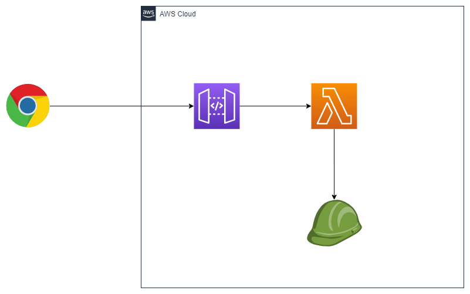

# CDKでAPIサンプルを更新

## AWSアーキテクチャー

API Gatewayを経由して、



## 環境へデプロイ

```bash
# 依存ライブラリーをダウンロード
npm install
# Typescriptをビルド
npm run build

# AWSへデプロイ
cdk deploy

# 最後に、API GatewayのDomain
```

> CFnテンプレート確認

```bash
cdk synth
```

## 動作確認

> API GatewayエンドポイントにCurlすると、「Hello」の挨拶が来る。

```bash
$ curl https://<api-id>.execute-api.ap-northeast-1.amazonaws.com/prod/
Hello, CDK! You've hit /
```
